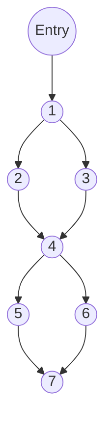
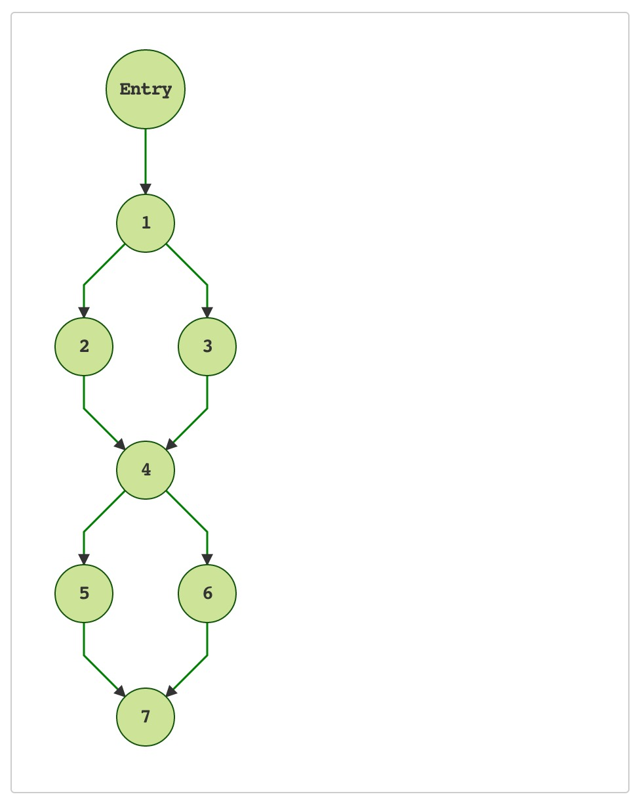
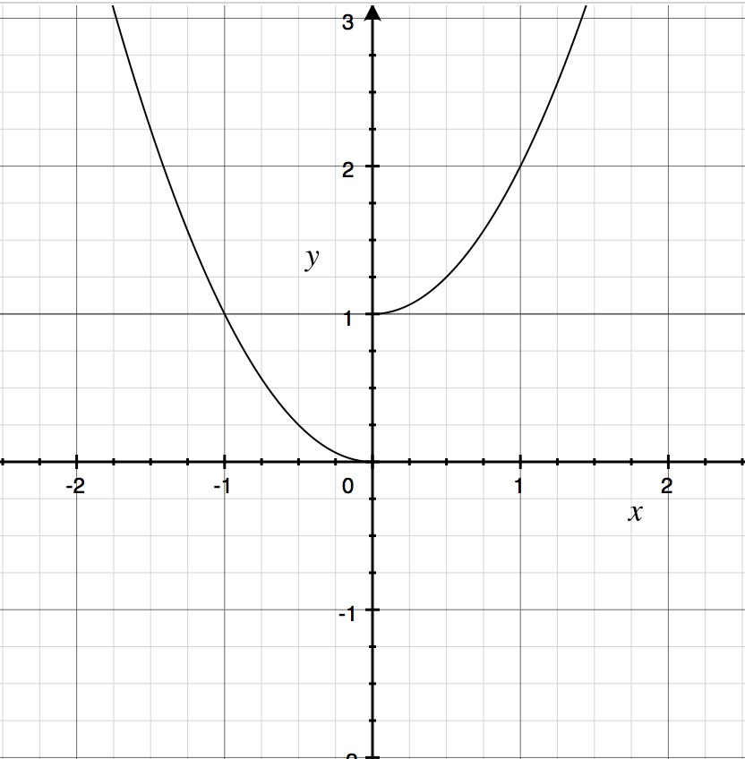

## The Code
``` java
public static void cal(int x) {
	int f = 0;
    if (x <= 0) {
    	f = x * x;
    } else {
    	f = x * x + 1;
    }
    if (f >= 1) {
    	System.out.println("Bigger than or equals 1");
    } else {
    	System.out.println("Smaller than 1");
    }
    System.out.println("End");
}

```

## The Graph



### Node Meanings
+ Node 1: `int f = 0;` and `if` condition, `x <= 0`
+ Node 2: Going `then` part, `f = x * x;`
+ Node 3: Going `else` part, `f = x * x + 1;`
+ Node 4: Another `if` condition, `f >= 1`
+ Node 5: Going `then` part, `System.out.println("Bigger than or equals 1");`
+ Node 6: Going `else` part, `System.out.println("Smaller than 1");`
+ Node 7: Printing, `System.out.println("End");`

### Paths
+ Path 1: [1, 2, 4, 5, 7]
+ Path 2: [1, 3, 4, 5, 7]
+ Path 3: [1, 2, 4, 6, 7]
+ Path 4: [1, 3, 4, 6, 7]

### Path 4 IS IMPOSSIBLE

+ Reason:
	+ When x <= 0, f(x) = x ^ 2.
	+ When x > 0, f(x) = x ^ 2 + 1, and f(x) couldn't be smaller than 1.